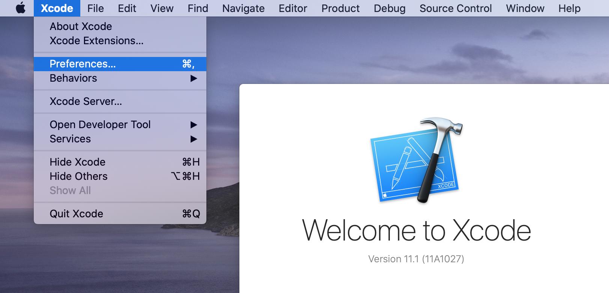
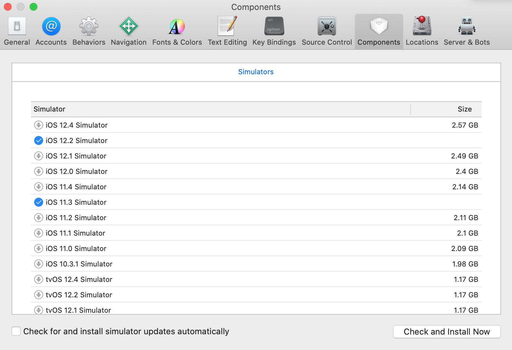
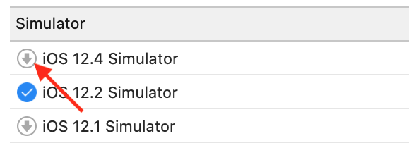

`Desarrollo Mobile` > `Swift Fundamentals`

## Instalación de simuladores

### OBJETIVO

- Conocer los diferentes simuladores disponibles en Xcode y como utilizarlos.

#### DESARROLLO

Abrir Xcode y dirigirse al menú *Xcode*, dar click en *Preferences...* (o bien teclear **command** + **, (comma)**).

Podremos elegir entre los siguientes simuladores:

- iOS Simulator: iPhone y iPad
- watchOS: Apple Watch
- tvOS: Apple TV

Aparecerá una ventana de configuración de Xcode, dirigirse a *Components*.
Dentro de esta vista, tenemos los simuladores descargados con una flecha azul y los No descargados con una flecha apuntando hacia abajo en gris.

Al dar click sobre esta flecha gris, se comenzará a descargar e instalar el simulador.

