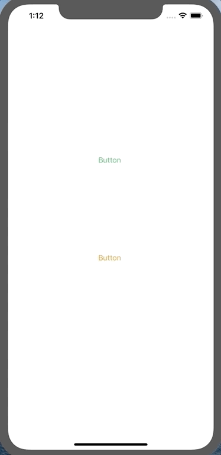
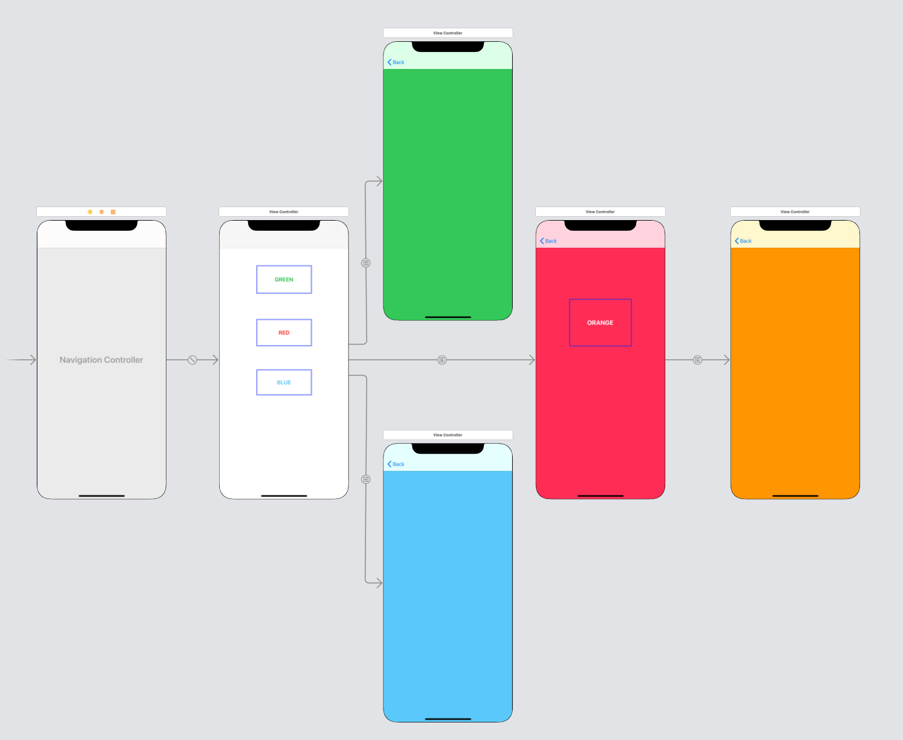
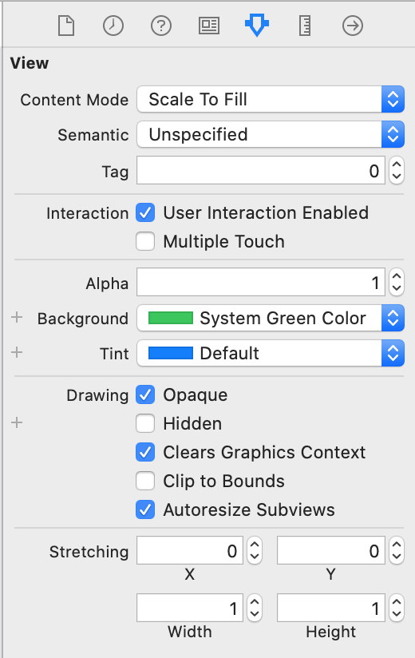
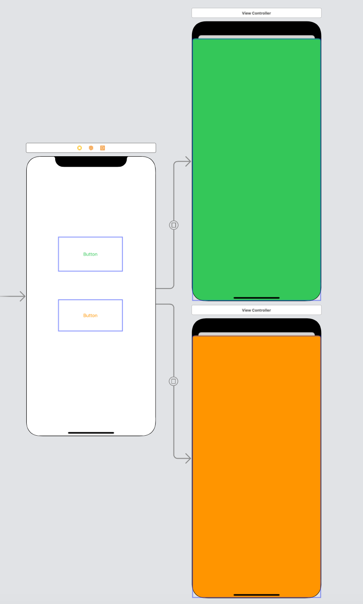
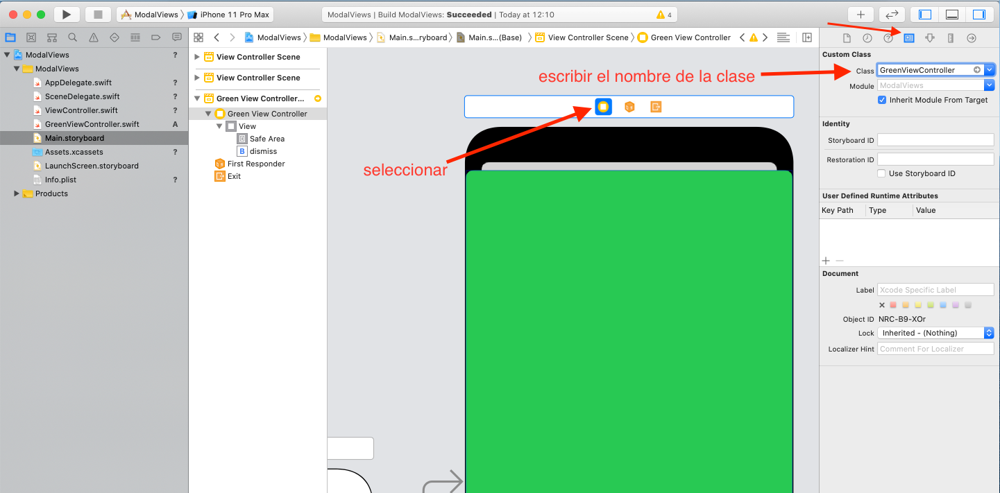
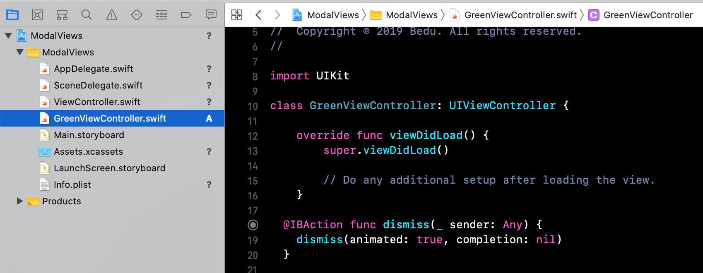
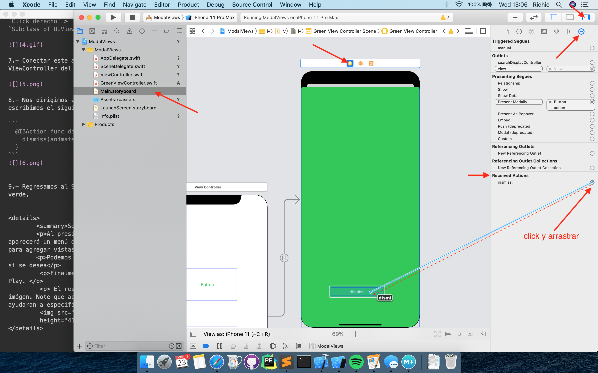
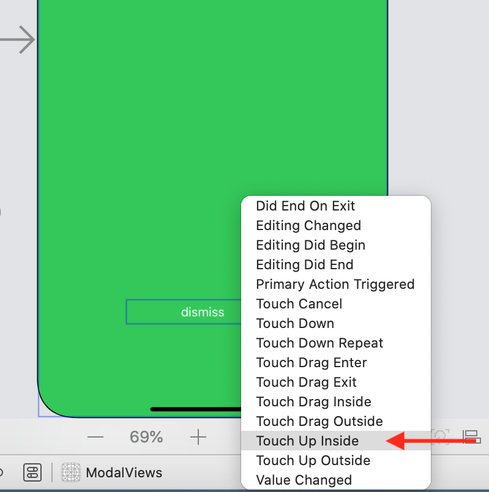

`Desarrollo Mobile` > `Swift Fundamentals`

## Agregando mas vistas modales y botón de dismiss



### OBJETIVO

- Crear un botón de *dismiss* desde la segunda vista y agregar mas vistas modales.

#### REQUISITOS

1.- Proyecto de Ejemplo-03 terminado y funcionando.


#### DESARROLLO

1.- Abrir el proyecto de *ModalViews*, ir al Storyboard y agregar un ViewController adicional.

2.- Agregar dos UIButton a la **primera** vista.

3.- Agregar un botón de **dismiss** a alguna vista de detalle, puede ser en ambas.

4.- Conectar el UIButton con cada vista agregada con **Present Modally**.

Ahora el botón de **DISMISS**.

6.- Agregar un nuevo archivo llamado *GreenViewController* como Clase.

7.- Conectar este archivo *GreenViewController* con un ViewController del Storyboard.

8.- Conectar el IBAction con el UIButton.

9.- Ejecutar la App.


<details>
        <summary>Solucion</summary>
        
<p>1.- Abrir el proyecto de *ModalViews*, ir al Storyboard y agregar un ViewController adicional.</p>

<p>2.- Agregar dos UIButton a la **primera** vista.</p>



<p>3.- Agregar un botón de **dismiss** a alguna vista de detalle, puede ser en ambas.</p>



<p>4.- Conectar el UIButton con cada vista agregada con **Present Modally**.</p>



<p>5.- Al ejecutar la App deberiamos poder ocultar las vistas de detalle.</p>

<p>Ahora el botón de <strong>DISMISS**</strong>.</p>

<p>6.- Agregar un nuevo archivo llamado <strong>GreenViewController</strong>, de la siguiente manera:</p>

`Click derecho` > `NewFile` > `Cocoa touch class` > `Subclass of UIViewController` > `Create`.


<p>7.- Conectar este archivo *GreenViewController* con un ViewController del Storyboard.</p>



<p>8.- Nos dirigimos al archivo *GreenViewController* y escribimos el siguiente código.</p>

```
  @IBAction func dismiss(_ sender: Any) {
    dismiss(animated: true, completion: nil)
  }
```



<p>9.- Regresamos al Storyboard, seleccionamos nuestra vista verde, y conectamos la acción con nuestro botón.</p>



<p>10.- Saldrá un pop-menu, seleccionamos *TouchUp Inside*.</p>



<p>11.- Ejecutar la App.</p>

</details>

