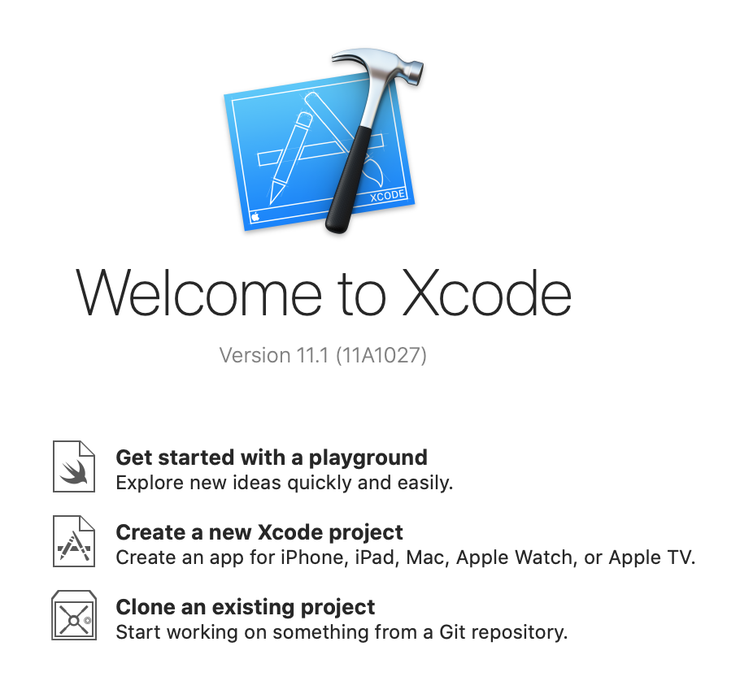
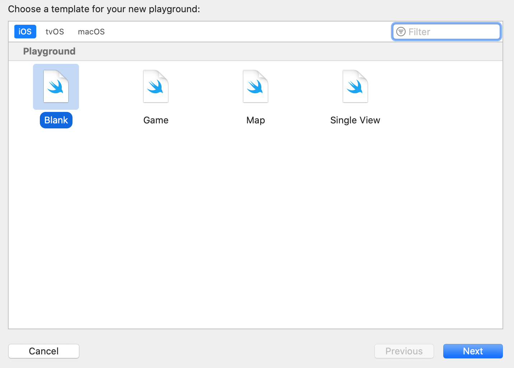
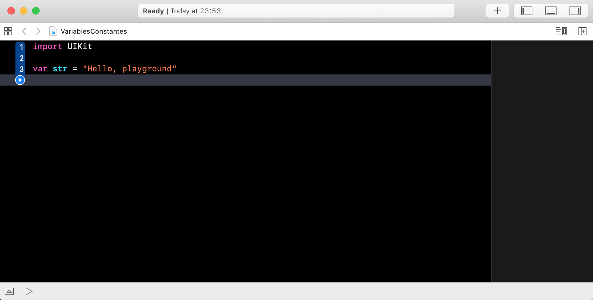

`Desarrollo Mobile` > `Swift Fundamentals`

## Variables y Constantes

### OBJETIVO

- Aprender la diferencia entre estos dos conceptos básicos de Swift.

#### REQUISITOS

1. Lectura previa de la Sesion 4.

#### DESARROLLO

1.- Abrir Xcode, y crear un nuevo Playground.

Seleccionar `Get started with a playground` > Elegir `Blank` > Y `especificar un Nombre` > `Finalizar`.

#### Variables 

Una variable es aquello que puede almacenar un valor y además podemos cambiar su valor.

La manera de escribirla (sintaxis) es comenzando con la palabra *var*, seguida de un nombre, un operador de asignación de valor **=** y un valor *5*.

> var miVariable = 5

Podemos especificar el tipo de dato, supongamos un tipo Entero **Int**, para ello usamos dos puntos seguido del tipo de dato deseado.

> var miVariable: Int = 5

#### Constantes

Una constante es aquella que puede almacenar un valor y **NO** podemos cambiar su valor.

La manera de escribirla (sintaxis) es comenzando con la palabra *let*, seguida de un nombre, un operador de asignación de valor **=** y un valor *5*.

> let pi = 3.1416

O especificando el tipo de dato:

> let pi: Float = 3.1416

#### Ultimo pero no menos importante

Al no especificar el tipo de dato Swift necesita "adivinar" o inferir que tipo de dato se esta usando, por ello si se desea crear un proyecto con buen código es mejor especificar el tipo de dato.

