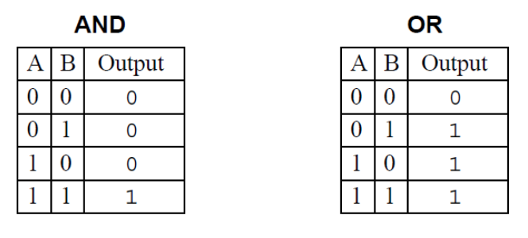

`Desarrollo Mobile` > `Swift Fundamentals`

## Lógica Booleana y compuertas

### OBJETIVO

- Lo que esperamos que el alumno aprenda

#### REQUISITOS

1. Xcode
2. Lectura previa de Compuertas Lógicas.

#### DESARROLLO

De acuerdo a la siguiente tabla, observar los valores de salida utlizando la función `print()`.

El valor `0` corresponde a un valor `false` y el `1` a un `true`.



Los operadores a utilizar son:

	- AND: &&
	- OR: ||
	- NOT: !

1.- En un Playground escribir una variable que utilice estos operadores, ejemplo:

```
let result = 1 < 2 && 4 > 3
// resultado deberia ser True ya que ambos se cumplen.
```

2.- Probar con la otra compuerta, OR.

```
let result = 5 < 2 || 4 > 3
// resultado deberia ser True ya que alguno se cumple.
```

3.- Declarar una variable de tipo `Bool` y utilizar el operador `NOT`.

```
let boolVar: Bool = true
let result = !boolVar
// resultado debe ser opuesto al declarado.
```

4.- Implementar las compuertas lógicas para cada valor de la tabla AND y OR.

```
		 // A      B
let AND = false && false 
let AND = true && false
let AND = false && true 
let AND = true && true 
```

```
		 // A      B
let OR = false || false 
let OR = true || false
let OR = false || true 
let OR = true || true 
```
